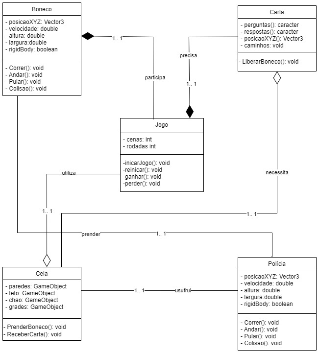

# Projeto Ilusão LP
# Leonardo Macêdo Aurieni 
# Jogo: A esperança através da música
# Link do projeto
https://drive.google.com/drive/folders/1JZxPayNxYY8WdZzjUF_dLpO7Vy5q926A?usp=sharing  
# Música: Ilusão - MC Hariel, MC Ryan SP, MC Davi, Djay W, Salvador da Rima e  DJ Alok
A música que é um funk, estilo musical que ganha cada vez mais espaço na cena, busca alertar e conscientizar as pessoas sobre problemas do nosso cotidiano, sem, é claro, deixar de apresentar à população as virtudes da periferia, com mensagens de alerta, esperança e fé.  
# Música: Saudades Mil - 509-E
Palavras de Afro-X: “'Saudades Mil' é uma música sobre sentir falta. Bate forte no coração do vagabundo.”  
A música relata a história de um homem que foi preso, que recebe uma carta e fica com muita saudades de amigos e família. Como a música ilusão, também foi feita para conscientizar sobre como a vida é.  
## Descrição do jogo
O jogo passa em uma comunidade onde o homem tem que fugir do policial por ter cometido coisas ilegais. Após ser preso, recebe uma carta com perguntas e tem que responder todas corretamente para ficar livre da prisão. 
# Como Jogar
 
# GameObjects usados
Peguei todos da loja de assets, a prisão eu modelei no Bender 3D e os texto do própio Unity.
 
# Cena 1 - Menu
 
 
Criei dois métodos, o jogar é para o botão 'play' onde quando eu clicar irá para a cena2. E o sair é para fechar a aplicação. Na função OnClick criei um empty, adicionei o script e arrastei na função, para selecionar o método. Nos botões adicionei uma imagem. Coloquei um panel e adicionei uma imagem para ficar de fundo. 
# Cena 2 - Fase 1
## Personagem
 
No personagem adicionei scripts simples para movimentação, rotação de câmera e 'congelar' ele para não tombar. 
## Policial
 
No policial coloquei um script para ele andar para frente automático, e outro para quando colidir com o personagem ir para a cena 3, ativei a opção is trigger para ele atravessar os objetos e desativei a gravidade pois se não ele atravessaria o chão. 
# Cena 3 - Fase 2
 
 
Para trocar as perguntas, abrir a carta, chegar no final e no tentar novamente, utilizei os botões com a função OnClick onde eu desativo a câmera que está ativada e ativo a próxima, com o SetActive (booleano). No botão menu, utilizei o metodo VoltarMenu, que vai para a cena 1 ao clica-lo. 
# Zerando o Jogo
https://github.com/Leo-Macedo/Projeto_Ilusao_LP/assets/127630556/ae18509b-4b6e-47c2-aa80-152577c68145

# Perdendo o Jogo
https://github.com/Leo-Macedo/Projeto_Ilusao_LP/assets/127630556/4df3f614-d0a9-492d-9068-836884591624
 
# Diagramas
## Diagrama de Classes
  
<h3> Descrição </h3>

Esse digrama de classes é sobre o jogo uma nova vida, onde tem as classes: Boneco; Carta; Jogo; Cela e Polícia. 
Onde a classe Boneco se relaciona com o Jogo que sem o Jogo ela não existe, e com a Polícia, que é uma relação simples onde o Polícia tem que prender o Boneco. 
A classe Carta se relaciona com o Jogo que sem ela o Jogo não existe. A relação com a cela é que precisa da Carta mas existe sem ela. 
Polícia tem um relacionamento simples com Cela onde ela usufuri para prender o Boneco. 

<h2>Diagrama de Casos de Uso</h2>
 
<h3>Documentação</h3>
 

